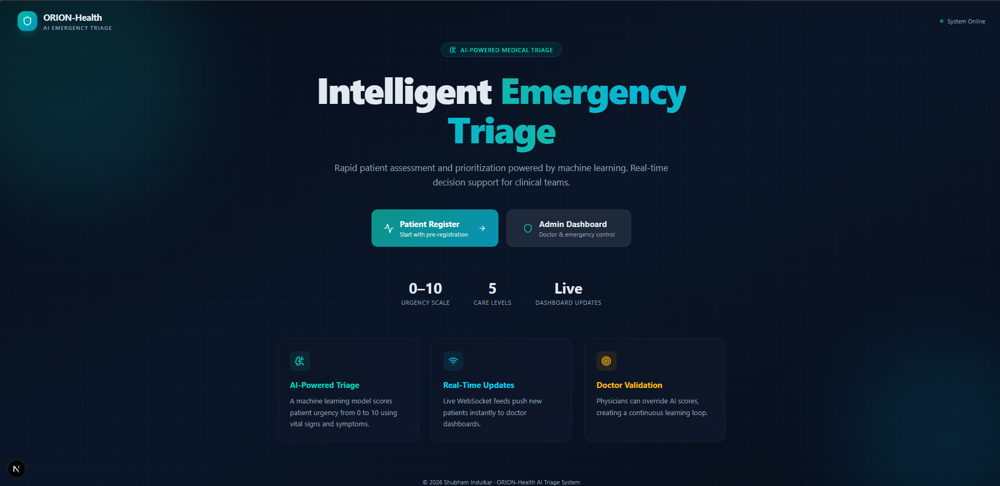
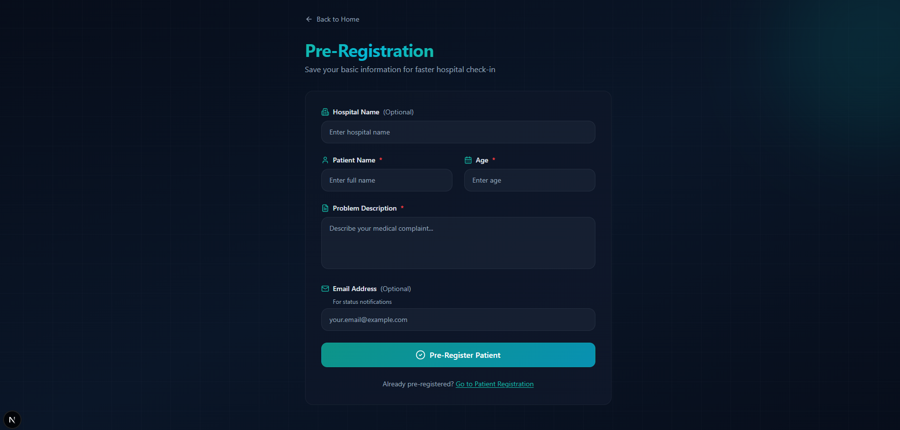
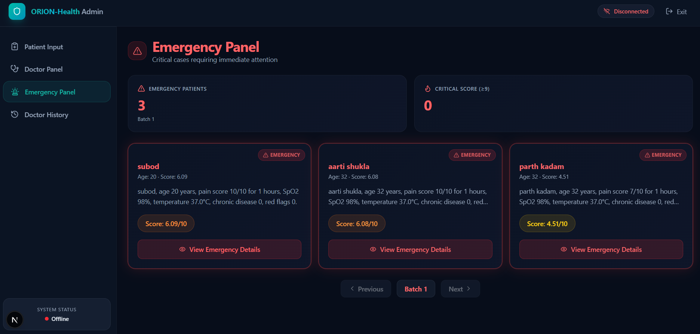
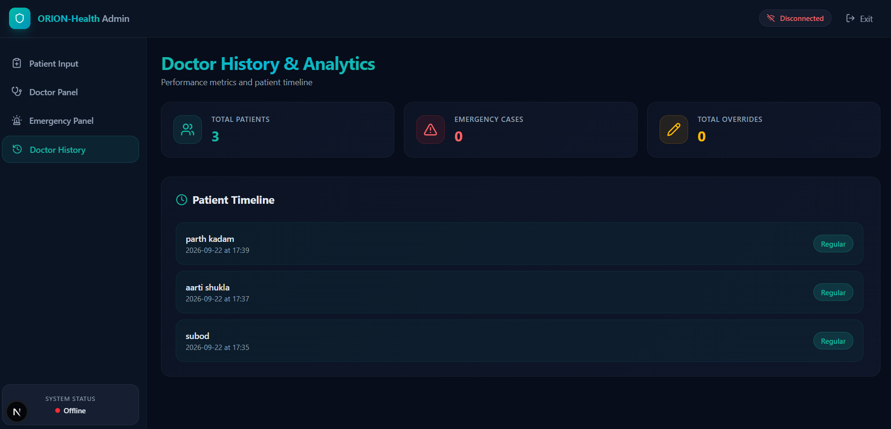
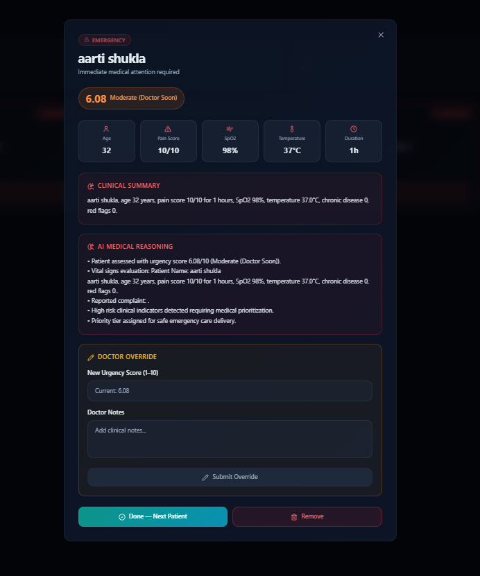

# ORION-Health

An AI-assisted emergency triage system: patients (or intake staff) enter symptoms and vital signs, and the app returns an urgency score from 0 to 10, an explanation of that score, and email alerts for serious cases. Doctors get a live dashboard where patients are sorted by urgency, and they can override any score the model produces.

[](https://github.com/Shubham-cde/orion-health/actions/workflows/ci-cd.yaml)

I built this for HackMatrix 2026. The idea came from how emergency departments actually run: the order people are seen in matters more than the order they arrive in, and that call gets made under time pressure. This is a demo of what software support for that decision could look like.

**This is not a medical device.** The model is trained on synthetic data and shouldn't be used for real clinical decisions.

## Screenshots

| Landing page | Pre-registration |
| :---: | :---: |
|  |  |

| Emergency queue | Doctor history |
| :---: | :---: |
|  |  |

Case detail, with the clinical summary, the AI's reasoning, and the doctor override box:



## What it does

Each submission runs through five small agents, one after another:

1. **Observer** pulls seven features out of the form: pain score, how long symptoms have lasted, age, SpO₂, temperature, chronic illness, and red-flag symptoms.
2. **Planner** scores urgency from 0 to 10 using a scikit-learn Gradient Boosting model, then applies any correction learned from past doctor overrides.
3. **Explainer** writes the reasoning in plain language using a local Llama 3 model through Ollama. If Ollama isn't running, it falls back to a rule-based explanation, so the app never breaks just because the LLM is unavailable.
4. **Action** emails the doctor when a case scores 7 or above, and emails the patient a status update with advice.
5. **Learner** stores doctor overrides. Once there are enough of them, it trains a correction model that nudges future scores, clamped to ±2 points so it can never swing a score wildly.

Scores map to five levels: under 3 is home care, 3–5 outpatient, 5–7 see a doctor soon, 7–9 priority, and 9+ emergency.

New patients appear on the doctor dashboard instantly over WebSockets, and emergency cases get their own queue. Patients can also pre-register, so their details fill in automatically at intake.

## Built with

Python, FastAPI and SQLAlchemy on the backend, with SQLite for storage and scikit-learn for the scoring model. The frontend is Next.js 16 with React 19, Tailwind, and shadcn/ui. Explanations come from Ollama running Llama 3 locally. Alerts go out over Gmail SMTP. GitHub Actions runs the checks and Render hosts the deployment.

## Running it locally

You'll need Python 3.10+ and Node.js 20+. Ollama is optional.

**Backend:**

```bash
python -m venv venv
venv\Scripts\activate          # macOS/Linux: source venv/bin/activate
pip install -r requirements.txt
python run.py
```

This starts the API on http://localhost:8000, with interactive docs at `/docs`. The first launch trains the urgency model, which takes a few seconds. After that it loads from disk. If the saved model was built with a different scikit-learn version, it retrains itself rather than failing.

**Frontend:**

```bash
cd orion-frontend
copy .env.example .env         # macOS/Linux: cp .env.example .env
npm install --legacy-peer-deps
npm run dev
```

Then open http://localhost:3000.

**Email alerts (optional):** copy `.env.example` to `.env` in the project root and set `EMAIL_SENDER` to the address alerts come from. Then pick one of two ways to send:

- `BREVO_API_KEY` sends over the [Brevo](https://www.brevo.com/) HTTPS API. This is what the deployed version uses, because most free hosting blocks the SMTP ports.
- `EMAIL_PASSWORD` sends over Gmail SMTP using an [App Password](https://myaccount.google.com/apppasswords), which needs 2-Step Verification. Handy locally.

If the Brevo key is set it wins; otherwise SMTP is used; if neither is set the app runs fine and just skips sending. `SMTP_SERVER` and `SMTP_PORT` override the Gmail defaults, and `DB_DIR` moves the SQLite files elsewhere.

**AI explanations (optional):** install Ollama and run `ollama pull llama3`. When it's running, explanations come from Llama 3.

## API

| Method | Endpoint | Purpose |
| :--- | :--- | :--- |
| POST | `/api/preregister` | Pre-register a patient |
| GET | `/api/preregister/search/{query}` | Search pre-registered patients |
| POST | `/api/patient/submit` | Submit intake data and run triage |
| GET | `/api/patient/history/{name}` | A patient's visit history |
| GET | `/api/doctor/patients` | Priority-sorted queue, ten per batch |
| GET | `/api/doctor/emergency` | Emergency queue |
| POST | `/api/doctor/override` | Doctor overrides an AI score |
| GET | `/api/doctor/history` | Override history |
| GET | `/api/admin/logs` | Audit log |
| WS | `/ws` | Live dashboard updates |

## Project layout

```
app/
  main.py              FastAPI app, routers, WebSocket endpoint
  ai_pipeline.py       Runs the five agents in order
  train_model.py       Generates synthetic data and trains the scoring model
  storage.py           In-memory priority queues for the dashboard
  agents/              observer, planner, explainer, action, learner
  ai/                  Scoring model, Ollama client, prompts
  automation/alerts.py Email alerts
  db/                  Models, CRUD, pre-registration and learning databases
  routes/              API endpoints
  schemas/             Request validation
orion-frontend/        Next.js frontend
tests/                 Backend tests
```

## Tests

```bash
python -m pytest tests -v
```

GitHub Actions runs on every push: linting, model training, and the backend tests, plus a production build of the frontend and a Docker build.

## Deployment

The backend runs on Render using the included `render.yaml`, with `EMAIL_SENDER` and `BREVO_API_KEY` set in the Render dashboard. The frontend runs on Vercel with its root directory set to `orion-frontend` and `NEXT_PUBLIC_API_BASE_URL` / `NEXT_PUBLIC_WS_URL` pointing at the backend URL.

On Render's free plan the backend sleeps after 15 minutes of inactivity, so the first request can take about a minute to wake it up, and the SQLite data resets on restart.

## What I'd do next

- **Authentication.** The doctor and admin pages are currently open to anyone with the link, which is the biggest gap for anything handling patient data. This is next on my list.
- Move the live queue out of memory, since it resets when the backend restarts. The records themselves are safe in the database.
- Train the model on a real clinical dataset instead of synthetic data.
- Send emails in the background so they don't slow down the request.

## Author

Shubham Indulkar — [github.com/Shubham-cde](https://github.com/Shubham-cde)
