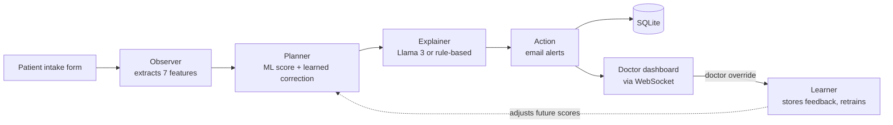

<div align="center">

# 🚑 ORION-Health

### AI-assisted emergency triage with real-time doctor dashboards

[](https://github.com/Shubham-cde/orion-health/actions/workflows/ci-cd.yaml)


</div>

ORION-Health helps emergency departments decide who needs care first. A patient's vital signs and symptoms go through a small multi-agent pipeline that produces a **0–10 urgency score**, a plain-language explanation, and automatic email alerts. Doctors see a live, priority-sorted queue and can override any score, and those overrides feed back into the system.

Originally built for **HackMatrix 2026 (Round 2)**.

> ⚠️ **Not a medical device.** This is a learning/demo project. The model is trained on synthetic data and must not be used for real clinical decisions.

---

## ✨ Features

- **Urgency scoring (0–10)** from pain level, symptom duration, age, SpO₂, temperature, chronic disease, and red-flag symptoms, using a scikit-learn Gradient Boosting model with a rule-based fallback.
- **Plain-language explanations** of each score, generated by a local Llama 3 model through [Ollama](https://ollama.com/) when it's running, with an automatic rule-based explanation when it isn't.
- **Live doctor dashboard**: new patients appear instantly over WebSockets, sorted by urgency, with a separate emergency queue.
- **Doctor overrides that teach the system**: validated corrections are stored, and after enough of them a correction model is trained to adjust future scores (clamped to ±2 points for safety).
- **Email alerts**: doctors get an alert for high/critical cases, and patients get a status update with advice.
- **Pre-registration**: patients can register ahead of time, and their details auto-fill at intake.
- **Audit log** of submissions and overrides.

## 🧠 How it works



| Score | Level | Meaning |
| :---: | :--- | :--- |
| 0 – 3 | Low | Home care |
| 3 – 5 | Mild | Outpatient visit |
| 5 – 7 | Moderate | See a doctor soon |
| 7 – 9 | High | Priority (doctor alert sent) |
| 9 – 10 | Critical | Emergency (doctor alert sent) |

## 🛠️ Tech stack

| Layer | Technology |
| :--- | :--- |
| Backend API | FastAPI, Uvicorn, Pydantic |
| Machine learning | scikit-learn (Gradient Boosting), pandas, NumPy, joblib |
| Explanations | Ollama + Llama 3 (optional, local) |
| Real-time | WebSockets |
| Database | SQLite via SQLAlchemy |
| Frontend | Next.js 16, React 19, Tailwind CSS 4, Framer Motion, shadcn/ui |
| Email | Gmail SMTP |
| CI / Deploy | GitHub Actions, Docker, Render |

## 🗂️ Project structure

```
orion-backend/
├── app/
│   ├── main.py              # FastAPI app, routers, WebSocket endpoint
│   ├── ai_pipeline.py       # Runs Observer → Planner → Explainer → Action
│   ├── train_model.py       # Generates synthetic data and trains the urgency model
│   ├── storage.py           # In-memory priority queues for the dashboard
│   ├── websocket.py         # WebSocket connection manager
│   ├── agents/              # observer, planner, explainer, action, learner
│   ├── ai/                  # model.py (scoring), ollama.py (explanations), prompts
│   ├── automation/alerts.py # Email alerts
│   ├── db/                  # SQLAlchemy models, CRUD, pre-registration and learning DBs
│   ├── routes/              # patient, triage, doctor, admin, preregister endpoints
│   └── schemas/             # Request validation
├── orion-frontend/          # Next.js frontend
├── tests/                   # Backend tests (pytest)
├── .github/workflows/       # CI pipeline
├── Dockerfile
├── render.yaml              # Render deployment blueprint
└── requirements.txt
```

## 🚀 Getting started

**Prerequisites:** Python 3.10+, Node.js 20+, and optionally [Ollama](https://ollama.com/) for AI-written explanations.

### 1. Backend

```bash
python -m venv venv
# Windows: venv\Scripts\activate    macOS/Linux: source venv/bin/activate
pip install -r requirements.txt
python run.py
```

The API runs at **http://localhost:8000** (interactive docs at `/docs`). On first start, the urgency model is trained automatically; it takes a few seconds.

### 2. Frontend

```bash
cd orion-frontend
cp .env.example .env          # Windows: copy .env.example .env
npm install --legacy-peer-deps
npm run dev
```

Open **http://localhost:3000**.

### 3. Email alerts (optional)

Copy `.env.example` to `.env` in the project root and fill in a Gmail address and a [Gmail App Password](https://myaccount.google.com/apppasswords) (requires 2-Step Verification). Without these, the app runs normally and just skips sending emails.

| Variable | Description |
| :--- | :--- |
| `EMAIL_SENDER` | Gmail address that sends alerts |
| `EMAIL_PASSWORD` | Gmail App Password (not your normal password) |
| `SMTP_SERVER`, `SMTP_PORT` | Optional, default to Gmail |
| `DB_DIR` | Optional folder for the SQLite databases (default: project root) |

### 4. AI explanations (optional)

Install Ollama, then run `ollama pull llama3`. While Ollama is running, explanations are written by Llama 3; otherwise a rule-based explanation is used.

## 🔌 API overview

| Method | Endpoint | Purpose |
| :--- | :--- | :--- |
| `POST` | `/api/preregister` | Pre-register a patient |
| `GET` | `/api/preregister/search/{query}` | Search pre-registered patients |
| `POST` | `/api/patient/submit` | Submit intake data and run triage |
| `GET` | `/api/patient/history/{name}` | A patient's visit history |
| `GET` | `/api/doctor/patients` | Priority-sorted queue (batches of 10) |
| `GET` | `/api/doctor/emergency` | Emergency queue |
| `POST` | `/api/doctor/override` | Doctor overrides an AI score |
| `GET` | `/api/doctor/history` | Override history |
| `GET` | `/api/admin/logs` | Audit log |
| `WS` | `/ws` | Live dashboard updates |

## 🧪 Tests and CI

```bash
python -m pytest tests -v
```

GitHub Actions runs on every push: backend lint, model training, and tests; a production build of the frontend; and a Docker image build.

## ☁️ Deployment

`render.yaml` deploys both services to [Render](https://render.com/). After the backend is live, set `NEXT_PUBLIC_API_BASE_URL` and `NEXT_PUBLIC_WS_URL` to its URL, and add `EMAIL_SENDER` / `EMAIL_PASSWORD` in the Render dashboard.

## 🗺️ Known limitations and roadmap

- **No authentication yet.** The doctor and admin pages are open to anyone with the link. Adding login is the next priority.
- The live queue is stored in memory, so it resets when the backend restarts (submitted records stay in the database).
- The urgency model is trained on synthetic, rule-generated data.
- Emails are sent during the request, which can add a short delay.

## 👤 Author

**Shubham Indulkar**: [github.com/Shubham-cde](https://github.com/Shubham-cde)
